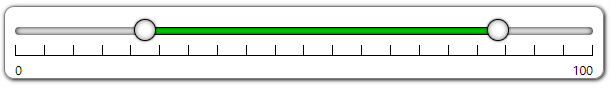

# multi-range-slider-react

a react component that can easy to use and interact with parent component with props and events.

------------

------------

# No Dependency only single component file and css file 

## MultiRangeSlider.jsx , MultiRangeSlider.css

### You can customize css to change UI/UX.

Following is the list of props that control the component 

|props   | type | default | description | 
| ------------ | ------------ | ------------ | ------------ |
| min  | Number  | 0 | Slider Minimum Value that user can set |
| max  | Number  | 100 | Slider Maximum Value that user can Set |
| minValue  | Number  | 25 | Slider range selected minimum value that will show default selected |
| maxValue  | Number  | 75 | Slider range selected maximum value that will show default selected |
| step  | Number  | 5 | Slider change value that will change when bar clicked or keyboard arrow key pressed |
| preventWheel  | Boolean  | false | true then it not accept mouse wheel to change its value. false then (shift + wheel) change minValue (ctrl+wheel) change maxValue, (ctrl+shift+wheel) change both values |
|ruler|Boolean|true|is ruler visible or not|
|label|Boolean|true|is label visible or not|

## How to Install
copy following code and run on CLI

`npm install multi-range-slider-react`

## How to use 
Example Code 

[download from gitHub](https://github.com/developergovindgupta/multi-range-slider-react "download from gitHub")

#### App.js

	import React, { useState } from "react";
	import MultiRangeSlider from "multi-range-slider-react";
	function App() {
	const [minValue, set_minValue] = useState(25);
	const [maxValue, set_maxValue] = useState(75);
	const handleInput = (e) => {
		set_minValue(e.minValue);
		set_maxValue(e.maxValue);
	};

	return (
		

			<MultiRangeSlider
				min={0}
				max={100}
				step={5}
				ruler={true}
				label={true}
				preventWheel={false}
				minValue={minValue}
				maxValue={maxValue}
				onInput={(e) => {
					handleInput(e);
				}}
			/>
		

		);
	}

	export default App;

